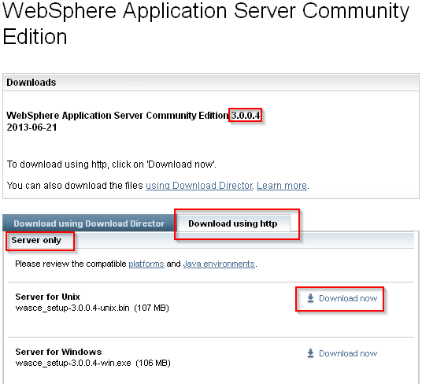
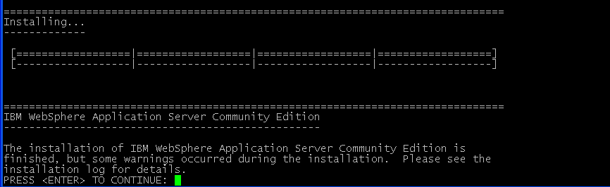
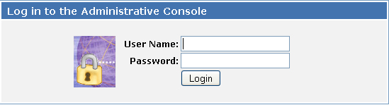

# Setting up WebSphere Community Edition 3.0 on CentOS 6

This guide will walk you through installing WebSphere Application Community Edition (WASCE) on CentOS 6. It assumes you've already installed CentOS 6.4

**NOTE**: I thought it was possible to use Eclipse from my development machine to connect to the CentOS server running WASCE, but that's impossible (well, not impossible, but the work-around is a pain.) So, if you want to develop and deploy J2EE applications, you (sigh):

* Install WASCE 3.0 on your development machine.
* Use your development machine to build and test locally.
* Use the CentOS WASCE server's Web Console to deploy and your J2EE application.

I agree. It's not cool.

## Download
Download the latest WASCE install files from [IBM](http://www-03.ibm.com/software/products/us/en/appserv-wasce) **and** the *Getting Started with WebSphere Application Server Community Edition* ebook. It's a very good introduction to WASCE and J2EE deployment.

My CentOS 6 server already came with a Java Runtime Environment so I downloaded the server only.

Since I used my Windows machine to download the file, I had to copy it to my CentOS server. I used [pscp](http://www.chiark.greenend.org.uk/~sgtatham/putty/download.html) to copy the file to `/tmp`.

## Install
We're going to install WASCE to the /opt/IBM/WASCE30 directory, but before we can do that, we prep the install directory. As the `root` user:

    mkdir /opt/IBM
    chgrp users /opt/IBM
    chmod g+w /opt/IBM
    usermod -a -G users theuser

This creates the `IBM` directory under `/opt` and gives all members of the `users` group write access to the directory. This will allow us to install WASCE as a non-root (unprivileged) user. In this case, `theuser` is my user ID under which I'll run the install.

To install WASCE, execute the install program as the non-root user:

    cd /tmp
    chmod +x ./wasce_setup-3.0.0.4-unix.bin
    ./wasce_setup-3.0.0.4-unix.bin

The installer will detect that you're not using a graphical user interface and switch to a console based install. You have to hit the Enter key many times to get past the license text, but be patient. Finally, the installer will ask you to accept the license terms and ask you where you want to install WASCE. Enter `/opt/IBM/WASCE30`.

I chose not to install the Eclipse Plugin since I'm not going to use Eclispe on the same server as the one on which I install WASCE.

The installer displays a summary of your choices and asks you to confirm. Hit Enter if you're happy.

In my case, the installer reports that the installation finished with warnings and to look at the installation log for details.

The installation logs are in the home directory of the user who ran the installer. In my case, the logs are in `/home/theuser`.

I decided to ignore the suggestion to check the log file and go straight to validating the install.

## Validate
 The following command starts WASCE:

    /opt/IBM/WASCE30/bin/startup.sh

If all went well, the startup script will tell you that Geronimo started in the background. Also, you should see a line that says something like:

    Using GERONIMO_OUT:    /opt/IBM/WASCE30/var/log/server.out

It's telling you that WASCE stores it's log file at `/opt/IBM/WASCE30/var/log/server.out`

Tail the file to see if there were and errors starting up. (I like to keep a separate SSH session open just to keep an eye on the `server.log`, a more detailed log file.):

    tail -30 /opt/IBM/WASCE30/var/log/server.out

You should be able to find a line saying:

    Server started

If you don't see this line, you're [Donald Duck](http://www.cockneyrhymingslang.co.uk/slang/donald_duck_1). (I know, I know, this guide describes only the Happy Day scenario. One day, I will include error paths as well.)

If the server started, try to visit the console page by going to this URL:

    https://yourserver:8443/console

Where, `yourserver` is the name or IP of your CentOS server. You should get a log-in prompt. If not, you may have to configure your firewall to accept traffic on port 8443. In my case, I had to run the following command as `root`:

    iptables -I INPUT 4 -p tcp -m state --state NEW -m tcp --dport 8443 -j ACCEPT

Navigate to `https://yourserver:8443/console` again and you should get a log-in screen. (You may have to ignore your browser's warning about an unrecognized certificate.)

Once you get to the login page, try logging in using a `system` and `manager` and the user ID and password. If you're successful, you'll see the WASCE Welcome Page.

That's it. Now, you can deploy your J2EE applications to WebSphere Application Server Community Edition 3.0 .
